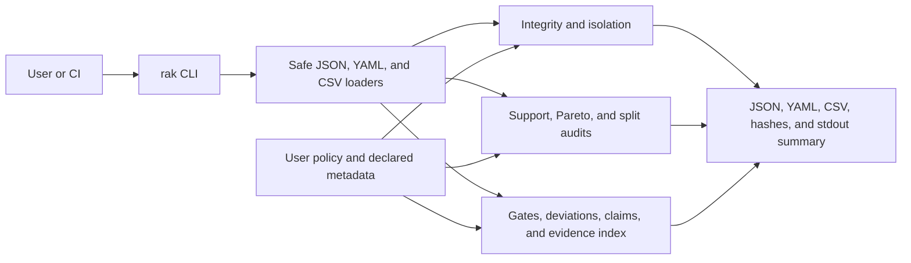

# Architecture

ResearchAuditKit is a small, local Python CLI. The parser dispatches to focused
audit modules; each module reads explicit files and policies, then writes
machine-readable records. Audited repository code is treated as bytes and paths,
not imported or executed.

## Components

- `integrity`: inventory, policy classification, baseline freeze/verify, portable
  paths, declaration seals, and structural workspace isolation.
- `support` and `optimization_audit`: empirical support summaries and checks of
  supplied Pareto/support labels.
- `validation`: split, leakage, fold-local, and determinism helpers driven by
  supplied metadata.
- `governance`: configured gates, deviation records, claim matrices, negative
  results, and evidence indexes.
- `io` and `reporting`: strict data loading, atomic output, formula-safe CSV cells,
  and machine-readable summaries.

## Trust boundary

The CLI trusts the user to choose a complete policy and supply truthful metadata.
It verifies only properties observable from those files and the local filesystem.
Local hashes do not create an external timestamp; a structural workspace check
does not establish identity or access control; a referenced evidence record does
not establish claim truth.

## Runtime properties

- Python 3.10 or newer and PyYAML 6 or newer.
- No runtime network call, database, GPU, background worker, or model execution.
- Inputs and reports are ordinary local JSON, YAML, and CSV files.
- CLI failures use documented process exit codes and JSON stderr for handled
  errors.
